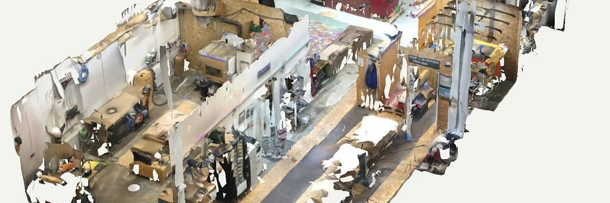

The Munich Maker Lab is a non-profit organization, creating an open community workspace, where you can learn, teach, share, make, hack, create, enjoy or simply relax. We try to create an environment that supports the do-it-yourself, hacker, and maker culture by providing workspace, tools, and infrastructure to our members and everyone else.

Everyone is welcome to visit when our website indicates an open status, as we don't have fixed opening times apart from our open Thursday. We are a fully community-driven space, and no one is paid for their contributions to the lab. 
Our members are an diverse group of tech-savvy and non-tech individuals alike. They come to build and explore new things, work on their personal projects, create improvements for the lab, make art, and learn new skills.

The Hacking Room Project was started in April 2013 to create a new Hacker-/Makerspace in Munich. After less than a year, in February 2014, we founded the Munich Maker Lab e.V. and moved into our first space, a 25m² room at Werk1 München. A year later, we expanded and moved into new rooms in Obersendling. Since early 2017, we have a  industrial space in the Kreativquartier.

Join us at one of our next meetups.

[→ Visit us ← ](visit)

## Organization

We are a non-profit organization, which is completely run by volunteers. If you want to become a member and support us on a regular basis, please fill out our [membership form](https://wiki.munichmakerlab.de/images/6/62/Membership_Form_2024.pdf), 
and bring it to one of our meetings. However, being a member is not a prerequisite to use the space, so feel free to just stop by.
For more details check our [Onboarding](https://wiki.munichmakerlab.de/wiki/Onboarding)

Being a member has some benefits, such as the possibility to get a 
key to the space. 

[Our statutes](statutes)  and [Our scale of fees](scaleoffees)

## More questions?

[→ Check our Frequently Asked Questions ←](https://wiki.munichmakerlab.de/wiki/Frequently_Asked_Questions)

OR

[→ Contact us ←](contact)

## Inventory

You can check out our current setup and machines in our [wiki](https://wiki.munichmakerlab.de)

## Support us

We need to pay rent for our space, maintenance for tools, and we'd also like 
to support projects that happen at the space. To do so, we need money. We try 
to cover our fixed costs with membership fees.

If you like what we do, and want to give us a quick boost: we also take 
donations. Since we are a non-profit organisation according to German law, we 
can send you a receipt, and you can hand it in with your taxes. Here's our 
bank details:

> Munich Maker Lab e.V.  
> IBAN: DE25701500001003311071  
> BIC: SSKMDEMMXXX  
> Bank: Stadtsparkasse München

Make sure to send us an email to vorstand[at]munichmakerlab.de, 
so we can get you your receipt.
