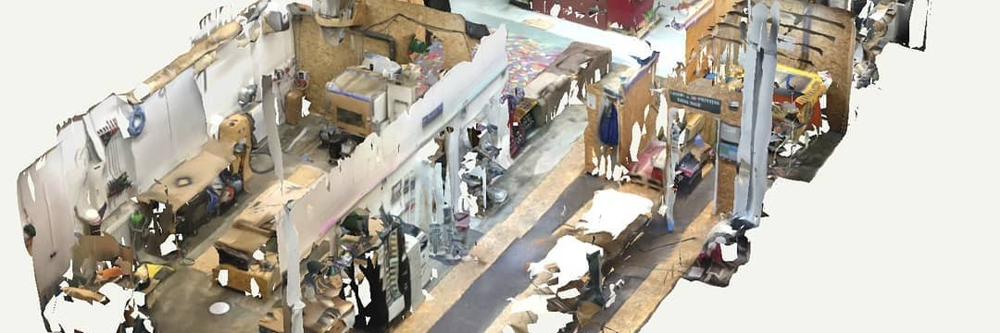

import { getRelativeLocaleUrl } from 'astro:i18n';

Das Munich Maker Lab ist eine gemeinnützige Organisation, die einen offenen Community-Workspace schafft, in dem du lernen, lehren, teilen, bauen, hacken, gestalten, Spaß haben oder einfach entspannen kannst. Wir möchten ein Umfeld schaffen, das die Do-it-yourself-, Hacker- und Maker-Kultur unterstützt, indem wir unseren Mitgliedern und allen anderen Arbeitsplätze, Werkzeuge und Infrastruktur zur Verfügung stellen.

Jede Person ist willkommen, uns zu besuchen, wenn unsere Website einen offenen Status anzeigt, da wir außer unserem offenen Donnerstag keine festen Öffnungszeiten haben. Wir sind ein vollständig gemeinschaftsgetragener Raum und niemand wird für seinen Beitrag zum Lab bezahlt.
Unsere Mitglieder sind eine vielfältige Gruppe aus technikaffinen und nicht-technischen Menschen. Sie kommen, um Neues zu bauen und zu entdecken, an eigenen Projekten zu arbeiten, das Lab zu verbessern, Kunst zu schaffen, neue Fähigkeiten zu lernen oder einfach Zeit miteinander zu verbringen. Wir sind auch eine Art sozialer Treffpunkt, an dem Menschen zusammenkommen und sich vernetzen.

Obwohl die meisten Menschen im Lab Deutsch sprechen, haben wir uns darauf geeinigt, Englisch als Schriftsprache und bei formellen Treffen zu verwenden, damit auch internationale Personen teilnehmen können.

Das Hacking Room Project wurde im April 2013 ins Leben gerufen, um einen neuen Hacker- und Makerspace in München zu schaffen. Weniger als ein Jahr später, im Februar 2014, gründeten wir den Verein Munich Maker Lab e.V. und zogen in unseren ersten Raum, ein 25 m² großes Zimmer im Werk1 München. Ein Jahr später erweiterten wir uns und zogen in neue Räume in Obersendling. Seit Anfang 2017 verfügen wir über eine Industriefläche im Kreativquartier.

Besuche eines unserer nächsten Treffen, um mehr zu erfahren: <a href={getRelativeLocaleUrl('de', 'visit')}>Besuch uns</a>

## Der Community-Ansatz

Im Munich Maker Lab sind wir überzeugt, dass Großartiges entsteht, wenn Menschen Initiative ergreifen, ähnlich wie bei Open-Source-Softwareprojekten. Unser Raum lebt davon, dass Mitglieder und Besucherinnen und Besucher ihre Zeit, Ideen und Fähigkeiten einbringen, um ihn weiterzuentwickeln. Ob es um die Wartung von Werkzeugen, die Organisation von Veranstaltungen oder die Entwicklung neuer Projekte geht, alles geschieht, weil jemand die Verantwortung übernimmt.

Wir bemühen uns, unsere Organisation und Prozesse so offen und transparent wie möglich zu gestalten. Jede Person ist eingeladen, sich einzubringen, Verbesserungen vorzuschlagen und Verantwortung zu übernehmen. Dieser Ansatz kann zunächst ungewohnt wirken, besonders wenn man stärker strukturierte oder hierarchische Organisationen kennt, bietet jedoch allen die Möglichkeit, die Gemeinschaft und den Raum aktiv mitzugestalten.

Man braucht keine formelle Rolle, um zu helfen. Unterstützung kann so einfach sein wie die Übernahme einer kleinen Aufgabe, die Mithilfe bei einem unserer „Mini-Jobs“ oder die Beteiligung an einem offenen Lab-Projekt. Jeder Beitrag, egal wie klein, hilft dem Raum zu wachsen und lebendig zu bleiben.

Im Kern funktioniert das Munich Maker Lab am besten, wenn Menschen es gemeinsam möglich machen.

## Organisation und Mitgliedschaft

Wir sind ein gemeinnütziger Verein, der vollständig ehrenamtlich betrieben wird.  
Möchtest du Mitglied werden? <a href={getRelativeLocaleUrl('de', 'join')}>Hier erfährst du, wie es geht</a>.

Eine Mitgliedschaft ist nicht erforderlich, um den Raum zu nutzen. Du kannst jederzeit vorbeikommen und dich umsehen.
Wenn du dich für eine Mitgliedschaft entscheidest, findest du weitere Informationen zum Aufnahmeprozess auf unserer Wiki-Seite: [Onboarding](https://wiki.munichmakerlab.de/wiki/Onboarding).

Mitglieder genießen zusätzliche Vorteile, wie zum Beispiel die Möglichkeit, einen persönlichen Schlüssel für den Raum zu erhalten.
Weitere Details findest du in unserer <a href={getRelativeLocaleUrl('de', 'statutes')}>Satzung</a> und unserer <a href={getRelativeLocaleUrl('de', 'scaleoffees')}>Beitragsordnung</a>.

## Weitere Fragen?

[Sieh dir unsere häufig gestellten Fragen an](https://wiki.munichmakerlab.de/wiki/Frequently_Asked_Questions) oder <a href={getRelativeLocaleUrl('de', 'contact')}>Kontaktiere uns</a>

## Inventar

Unser aktuelles Setup und unsere Maschinen kannst du in unserem [Wiki](https://wiki.munichmakerlab.de) einsehen.

## Werkbereiche

Unser Space ist für eine Vielzahl von Making- und Hacking-Aktivitäten ausgestattet:

3D-Druck · CNC-Fräse · Laserschneiden · Elektronik · Programmieren · Digitale Medien · Holzbearbeitung · Metallbearbeitung · Schweißen · Kunststoff · Textil · Siebdruck · Fahrrad · Lebensmittel · Flipper · Hacking · DIY · Reparatur · Kunst · Tiffany-Glaskunst

## Teil des Netzwerks offener Werkstätten

Das Munich Maker Lab ist Teil des [Verbundes offener Werkstätten](https://offene-werkstaetten.org/werkstatt/munichmakerlab), einer Plattform, die offene Werkstätten und Makerspaces in Deutschland und darüber hinaus vernetzt. Wer auf Reisen ist oder einen Space in der Nähe sucht, findet dort viele weitere interessante Orte der Maker- und Open-Workshop-Community.

## Unterstütze uns

Gefällt dir, was wir tun? Du kannst uns mit einer Spende unterstützen – alle Details findest du auf unserer <a href={getRelativeLocaleUrl('de', 'donate')}>Spenden-Seite</a>.
