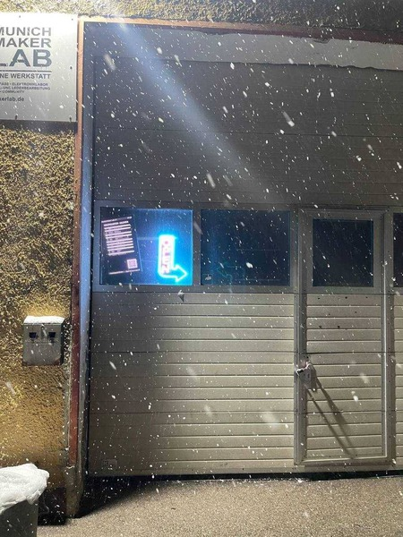

import { getRelativeLocaleUrl } from 'astro:i18n';

## Komm zu unserem Open Thursday

Der Open Thursday ist für alle da. Du musst kein Mitglied sein, um vorbeizukommen, und wir bieten auch Führungen an.

Es ist Donnerstag und Zeit für ein weiteres Vereinstreffen des MuMaLab e.V. Wir haben 3D-Drucker, eine CNC-Fräse, einen großen Lasercutter, Arduinos, Holz- und Metallwerkzeuge sowie kalte Getränke, alles in der gemütlichen Atmosphäre unserer großen Industriehalle. Komm vorbei, hilf mit, tausche dich aus und lerne neue Leute kennen.

Noch kein Vereinsmitglied? Komm vorbei und lerne uns kennen. Wir freuen uns immer über neue Gesichter.

Jeden Donnerstag ab 18 Uhr.

Du hast donnerstags keine Zeit? Schau einfach vorbei, wenn der Space-Status auf unserer Website „open“ anzeigt, oder besuche eine unserer anderen <a href={getRelativeLocaleUrl('de', 'events')}>Veranstaltungen</a>.

## Adresse

Munich Maker Lab  
Dachauerstr. 112h  
80636 München

## So findest du uns

Wenn du durch den Haupteingang der Dachauerstr. 112 gehst, halte dich fast geradeaus und gehe in das Gebäude mit den zwei weißen Garagentoren.

<iframe
  frameborder="0"
  scrolling="no"
  marginheight="0"
  marginwidth="0"
  src="https://www.openstreetmap.org/export/embed.html?bbox=11.548647880554201%2C48.15798972420428%2C11.551544666290285%2C48.15957318159677&amp;layer=mapnik&amp;marker=48.158780564401%2C11.550096273422241"
  style="width:100%;height:300px;"
></iframe>

 

<small>[Größere Karte anzeigen](https://www.openstreetmap.org/node/3426114357#map=19/48.15884/11.55063)</small>

## Eingang

