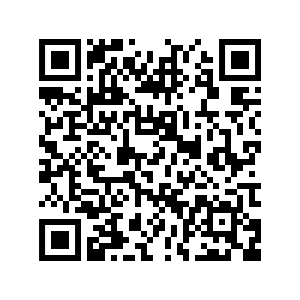
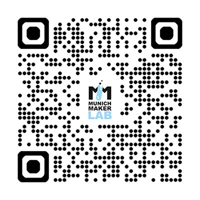

## Support Munich Maker Lab

Running a makerspace takes more than passion – it takes resources. We pay rent for our hall, maintain our tools and equipment and support the projects happening here every week. Membership fees cover our fixed costs, but every little extra helps us do more.

If you love what we do and want to give us a boost, consider making a donation. As a registered non-profit organisation under German law, we can issue an official donation receipt that you can use for your tax return.

After your transfer, drop us an email so we can send your receipt your way. Thank you for supporting the community!

## Bank Transfer

> **Recipient:** Munich Maker Lab e.V.  
> **IBAN:** DE25 7015 0000 1003 3110 71  
> **BIC:** SSKMDEMMXXX  
> **Bank:** Stadtsparkasse München

Scan with your banking app to pre-fill the transfer:

## PayPal

Scan the code or use the [donation link](https://www.paypal.com/donate/?hosted_button_id=YH5UMH7U84L5Y)

