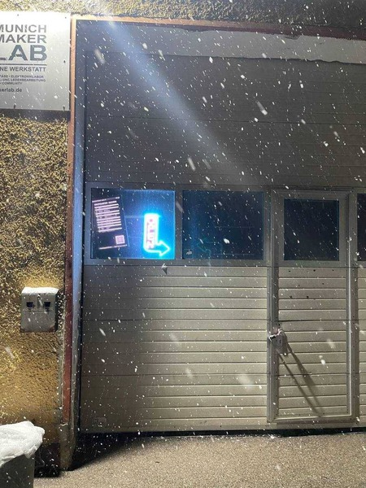

## Join us on Open Thursday

When? Every Thursday starting at 6 PM.

What? Open Thursdays are for everyone! You don't need to be a member to join us, and we'll be offering tours.
Get to know our space and equipment. We have 3D printers, a CNC router, a large laser cutter, microcontrollers, wood and metal tools, and cold drinks - all in the cozy atmosphere of our big industrial-style hall. Come by to help out, chat, and meet new people!

Where? Munich Maker Lab, Dachauer Str. 112h, 80636 München

But .. I can't make it on Thursdays.
No worries drop by anytime the status on our website shows Open.

## Become a member

    <ul>
        <li>Stop by at our Open Thursday have a look at our space and tools. We'll show you around and give a short tour.</li>
        <li>If you like our lab and want to become a bember you can either print out the [membership form](https://wiki.munichmakerlab.de/images/e/ee/2026_Mitgliedsantrag_-_Bi-Lingual_-_Digital.pdf) and put it in the letterbox or send it directly to vorstand@munichmakerlab.de </li>
        <li>You will get an e-mail when your application was processed (takes one or two weeks). In the meantime you can join our community at [chat.munichmakerlab.de](https://chat.munichmakerlab.de/)</li>
        <li>The attendance at the onboarding course is mandatory in order to get a key. It takes place every Thursday and Saturday at 8 PM. If you can't make it at those days drop a message in the [#_general](https://chat.munichmakerlab.de/) channel and we'll find a suitable date.</li>
        <li>In order to use some tools like our CNC, Laser Cutter, 3D printers or the bigger workshop machines (table saw, mitre saw, etc.) you need to take introduction courses. They can be booked at [tickets.munichmakerlab.de](https://tickets.munichmakerlab.de/)</li>
        <li>You're now an official member of the Munich Maker Lab! Welcome to our maker community. We're curios about your next project.</li>
    </ul>

## Find the space

Going in through the main entry of Dachauerstr. 112, head into the building 
almost straight ahead, with the two white garage doors.

<iframe frameborder="0" scrolling="no" marginheight="0" marginwidth="0" 
src="https://www.openstreetmap.org/export/embed.html?bbox=11.548647880554201%2C48.15798972420428%2C11.551544666290285%2C48.15957318159677&amp;layer=mapnik&amp;marker=48.158780564401%2C11.550096273422241" 
style="width:100%;height:300px;"></iframe> 
<small>[Show bigger map](https://www.openstreetmap.org/node/3426114357#map=19/48.15884/11.55063)</small>

## Entrance

