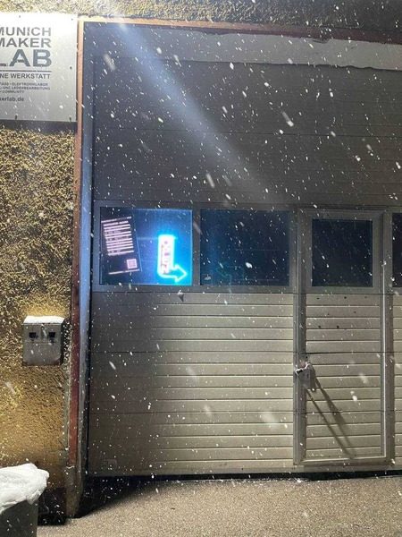

import { getRelativeLocaleUrl } from 'astro:i18n';

## Join us for Open Community Thursday

Every Thursday from 6 PM, Munich Maker Lab opens its doors to everyone – no membership needed, no agenda required. Just show up.

Whether you want to tinker on a personal project, explore new ideas or simply hang out and meet like-minded people, Open Community Thursday is the place to be. We have 3D printers, a CNC router, a large laser cutter, Arduinos, wood & metal tools and cold drinks – all inside our spacious industrial-style hall.

New here? We offer guided tours so you can see the space, discover what's possible and get to know the community. We love meeting new faces!

**When:** Every Thursday, starting at 6 PM

**Who:** Everyone – members and non-members alike

**Cost:** Free to visit

Can't make it on a Thursday? Check the Space status on our website for spontaneous open hours or browse our <a href={getRelativeLocaleUrl('en', 'events')}>Events</a> for other opportunities to visit.

## Address

Munich Maker Lab  
Dachauerstr. 112h  
80636 München

## Find the space

Coming in through the main entry of Dachauerstr. 112, head into the building
almost straight ahead, with the two white garage doors.

<iframe
  frameborder="0"
  scrolling="no"
  marginheight="0"
  marginwidth="0"
  src="https://www.openstreetmap.org/export/embed.html?bbox=11.548647880554201%2C48.15798972420428%2C11.551544666290285%2C48.15957318159677&amp;layer=mapnik&amp;marker=48.158780564401%2C11.550096273422241"
  style="width:100%;height:300px;"
></iframe>
 
<small>[Show bigger map](https://www.openstreetmap.org/node/3426114357#map=19/48.15884/11.55063)</small>

## Entrance

